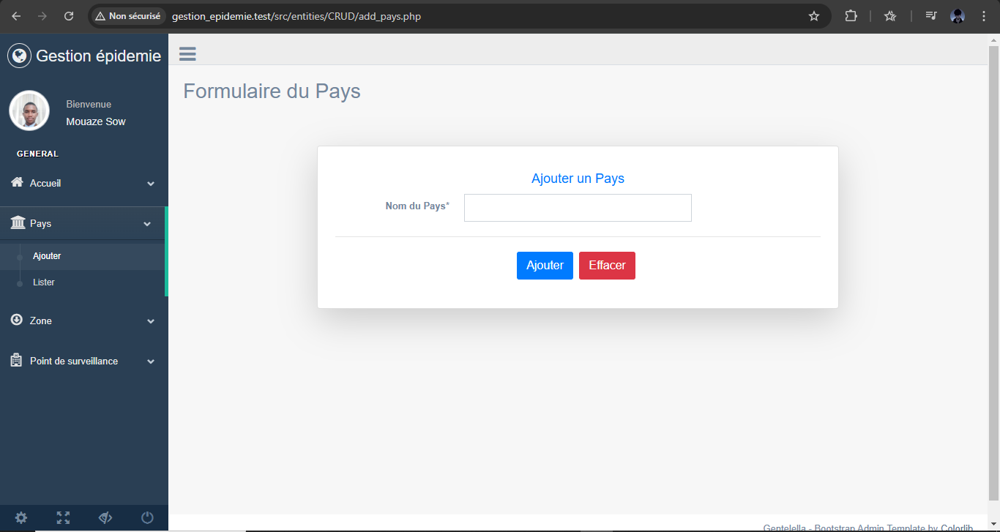
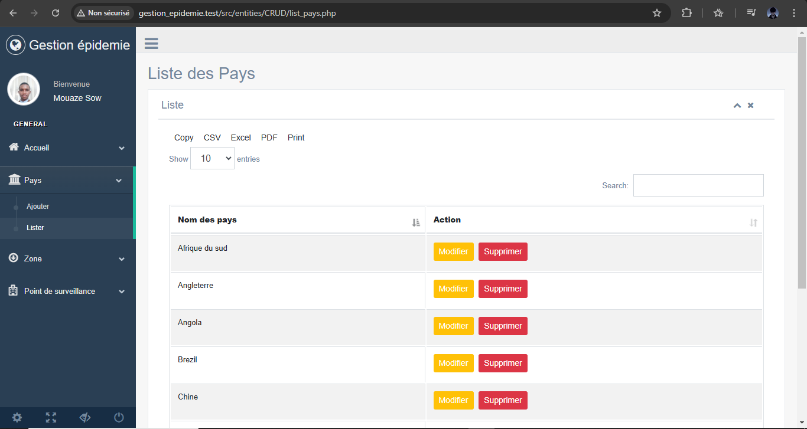
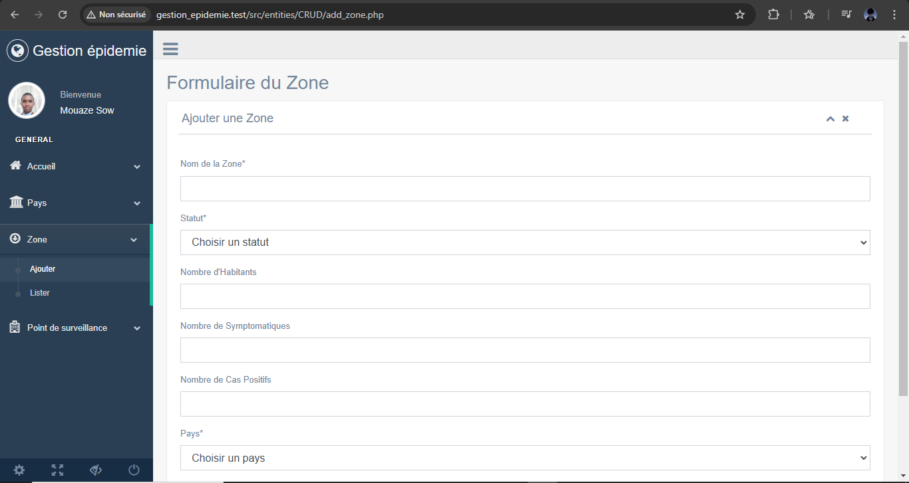
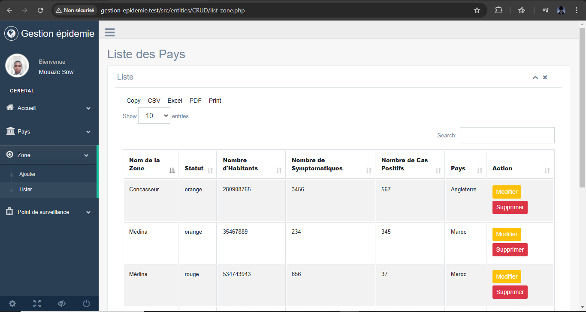
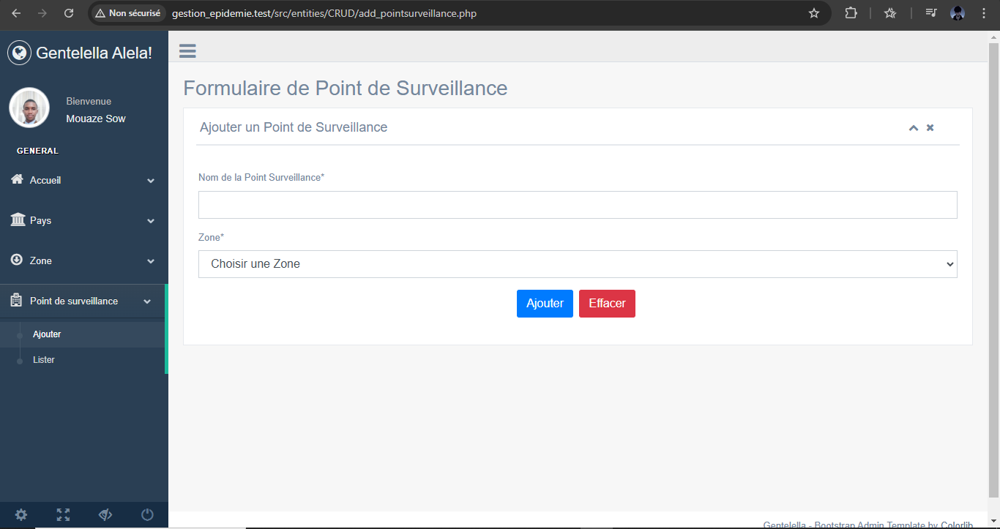

# 🦠 Système de Gestion d'Épidémie

Une application web PHP permettant de gérer et suivre la propagation d'épidémies à travers différentes zones géographiques.

## ✨ Fonctionnalités

- 🌍 Gestion des pays
- 🗺️ Gestion des zones géographiques avec leurs statuts (vert, orange, rouge)
- 🏥 Suivi des points de surveillance
<!-- - 📊 Statistiques par zone (nombre d'habitants, cas symptomatiques, cas positifs) -->

## 🛠️ Technologies utilisées

- 🐘 PHP 8.x
- 💾 Doctrine ORM
- 🗄️ MySQL/MariaDB
- 🎨 HTML/CSS/JavaScript
- 🎯 Bootstrap

## 📁 Structure du projet

```
Gestion_Epidemie/
├── src/
│   ├── entities/        # Classes des entités Doctrine
│   │   └── CRUD/       # Opérations CRUD
│   └── component/      # Composants réutilisables
├── bootstrap.php       # Configuration Doctrine
└── composer.json       # Dépendances du projet
```

## 📥 Installation

1. Clonez le repository
2. Installez les dépendances :
```bash
composer install
```
3. Configurez votre base de données dans `bootstrap.php`
4. Créez la base de données :
```bash
vendor/bin/doctrine orm:schema-tool:create
```

## 📋 Prérequis

- PHP 8.x
- Composer
- MySQL/MariaDB
- Serveur web (Apache/Nginx)
- IDE (VS Code, PHPStorm, etc.)
- Git

## 🤝 Contribution

Les contributions sont les bienvenues ! Voici comment vous pouvez contribuer :

1. 🍴 Fork le projet
2. 🌿 Créez une branche pour votre fonctionnalité 
3. ✍️ Commit vos changements 
4. 📤 Push vers la branche
5. 🔍 Ouvrez une Pull Request

### Guide de contribution

- Respectez les standards PSR-12 pour le code PHP
- Ajoutez des commentaires pour le nouveau code
- Mettez à jour la documentation si nécessaire
- Ajoutez des tests pour les nouvelles fonctionnalités

## 📸 Captures d'écran

### Page d'accueil


### Gestion des Pays



## 📸 Captures d'écran actualisées

### Gestion des Zones



### Gestion des Points de Surveillance



## 🔄 Dernières mises à jour

- ✨ Ajout de la gestion complète des zones géographiques
- 🔍 Implémentation des points de surveillance
- 📊 Amélioration des fonctionnalités de suivi statistique
- 🛠️ Optimisation des performances de la base de données
- 🎨 Amélioration de l'interface utilisateur
- 🐛 Correction de bugs mineurs

## 🚀 Fonctionnalités à venir

- 📈 Dashboard interactif avec graphiques
- 🌍 Carte interactive des zones
- 📱 Version mobile responsive
- 🔔 Système de notifications
- 📊 Export des données en PDF/Excel

## 🗃️ Modèle de données

- **Pays**: Entité représentant un pays
- **Zone**: Région géographique avec des indicateurs épidémiques
- **PointSurveillance**: Points de contrôle dans les zones

## 🙏 Remerciements

- Doctrine Team pour l'excellent ORM
- La communauté PHP
- Bootstrap Team pour le framework CSS
- Tous les contributeurs qui ont participé au projet
- Les utilisateurs pour leurs retours et suggestions

## 📄 Licence

MIT

## 👨‍💻 Auteur
[Thierno Maadjou Sow]

### Thierno Maadjou Sow
- 📧 Email: [thiernomaadjous@gmail.com]
- 💼 LinkedIn: [Thierno Maadjou Sow](https://www.linkedin.com/feed/?trk=hb_signin)
- 🌐 GitHub: [ThiernoMaadjou](https://github.com/ovvoso)

## 📞 Contact

Pour toute question ou suggestion, n'hésitez pas à me contacter !

---
⭐ Si ce projet vous a été utile, n'hésitez pas à lui mettre une étoile sur GitHub !
